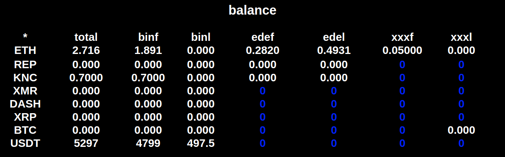

# coin aggregator

This node.js app provides a framework to aggregates information, both public and account specific, from multiple exchanges and synchronizes and displays.

Most important functions include price alerts, watching for arbitrage opportunities and tracking current balances and recent trades.

Currently added exchanges:

<p float="left">
  
   
  
  
</p>

## Key features

In the **alert section**, you can input the acceptable price range for each coin. When the price is higher or lower than set values you will receive audio alerts. The rightmost column lists the exchanges from which data has been received. Clicking on any of the leftmost buttons opens the respective coin's global orderbook.

You can set the minimum arbitrage opportunity you would like to receive alerts for in the **arbitrage section**. Coin names turning blue here indicate that the data is more than 5 seconds old and hasn't been replaced with newer data.


The **global orderbook** lets you see orders from multiple exchanges. The rightmost column shows the quantity of your own orders(if any). Orders against BTC will be converted to their current equivalent against ETH.


You can see synced balances from all connected exchanges in **balances**. Blue 0 indicates data not yet received.



Then there is **ticker**, where you can see a brief overview of selected coins courtesy coinmarketcap API, and **trades** where the most recent trades are posted as they happen.

## Getting started 

To run this app you need Node.js, you can get it [here](https://nodejs.org/en/download/ "node's Homepage").
Once that is taken care of clone this repository, cd into it, and install dependencies with npm
```
git clone https://github.com/praneethmendu/coin-aggregator.git
cd coin-aggregator
npm i
```

You need to add your credentials to be able to access your personal data(balances, trades, own orders). This varies by exchange.

##### Binance

create an API username and key on binance and add it to the exe/bin.js file 


##### Forkdelta (etherdelta)

add your ethereum address to the file exe/ede.js


##### IDEX 

add your ethereum address to the file exe/idex.js

**Warning:** You API keys are as powerful as your passwords please be careful not to share it or the files containing it anywhere or with anyone.

##### adding tokens

the main list of coins can be added by editing the main variable in server.js and add to the watchlist by editing the ticker variable. Some exchanges require more specific instructions which can be found on individual exchange scripts in the exe folder.

## Running the app

When in the app folder, start the app with
```
node server
```
Then go to http://localhost:7777 from your browser

## Future Development 

I strongly encourage users to contribute to this project. Adding more exchanges is the first order of business. If you have specific requests or wish to engage me professionally it's praneethmendu on gmail. 
