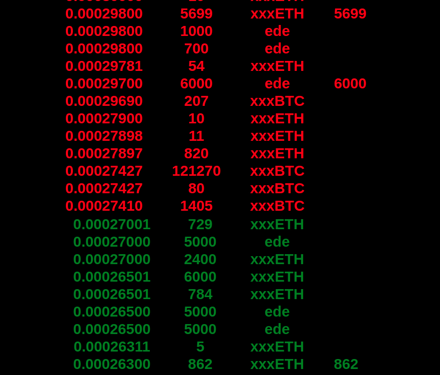

# coin aggregator

This node.js app aggregates information, both public and account specific, from multiple exchanges and synchronizes them to be displayed on a locally generated webpage.

Most important functions include price alerts, watching for arbitrage opportunities and tracking current balances and recent trades.

## Key features

In the **alert section** you can input the acceptable price range for each coin. When the price is higher or lower than set values you will recieve audio alerts. The rightmost column lists the exchanges data has ben received from. Clicking on any of the leftmost buttons opens the respective coin's global orderbook.

You can set the minimum arbirage opportunity you would like to recieve alerts for in the **arbirage section**. Coin names turning blue here indicate that the data is more than 5 seconds old and hasn't been replaced with newer data.

The **global orderbook** lets you see orders from multiple exchanges. The rightmost column shows the quantity of your own orders, if any.You can see an overview of your balances and trades from different exchanges in this secton. The  blue '0' values indicate no data recieved. Orders against BTC will be converted to their current equivalent against ETH.

The last sections are **ticker**, where you can see a brief overview of selected coins derived from coinmarketcap API, and **trades** where the most recent trades as they happen.

## Getting stared 

To run this app you need Node.js and NPM installed. If you are new to this you can find instructions here.

Once that is taken care of clone this reposetory and cd into it

Then install dependencies by running 

You need to add your credentials to be able to access your personal data(balances, trades, own orders). This varies by exchange.

##### Binance

create an API username and key on binance and add it to the exe/bin.js file 

##### Forkdelta (etherdelta)

add your ethereum address to the file exe/ede.js

##### IDEX 

add your ethereum address to the file exe/idex.js

**Warning:** You API keys are as powerfull as your passwords please be carefull not to share it or the files containing it anywhere or with anyone.

##### adding tokens

the main list of coins can be added by editing the main variable in server.js and add to the watchlist by editing the ticker variable. Some exchanges require more specific instructions which can be found on individual exchange scripts in the exe folder.

## Running the app

You can start the app with

Then go to http://localhost:7777 from your browser

## Future Development 

I strongly encourage users to contribute to this project. Adding more exchanges is the first order of business. If you have specific requests or wish to enguage me professionally it's praneethmendu on gmail. 
